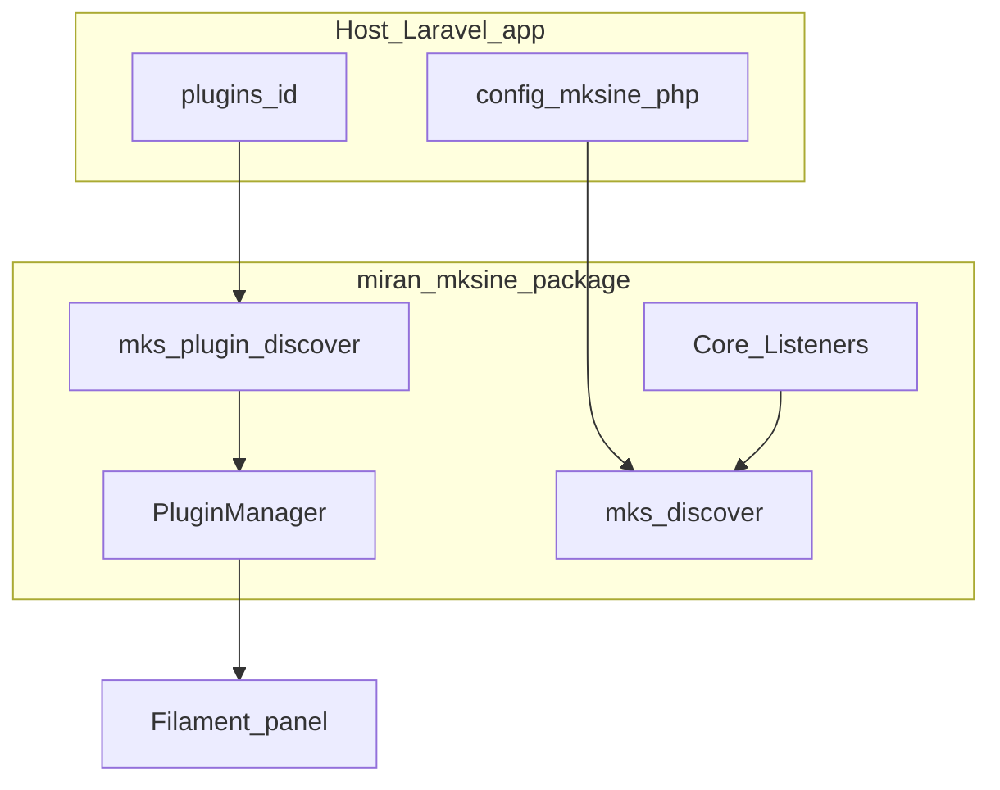

# MKSine developer documentation — overview

MKSine is a Laravel + Filament 4 CMS package (`miran/mksine`). This `docs/` tree is the **canonical**, **package-portable** reference for extending the system (plugins, hooks, operations). Cursor skills in a host repo should link here instead of duplicating long explanations.

## Documentation version

These docs describe the package revision you have installed. When upgrading, compare **[`CHANGELOG.md`](../CHANGELOG.md)** and the version in **[`composer.json`](../composer.json)** (and your app’s `composer.lock` entry for `miran/mksine`) so command signatures and contracts still match.

## Where to start

| I want to… | Read |
|------------|------|
| Ship a first plugin end-to-end | [10-plugin-golden-path.md](10-plugin-golden-path.md) |
| Understand hooks (DB vs runtime) | [20-hooks-contract.md](20-hooks-contract.md) |
| Look up Artisan commands | [30-commands-reference.md](30-commands-reference.md) |
| Auth, Shield, user model rules | [40-security-auth.md](40-security-auth.md) |
| Fix common errors | [50-troubleshooting.md](50-troubleshooting.md) |
| Deploy / nginx / Apache / document root / release zip | [60-deployment-hosting.md](60-deployment-hosting.md) |
| Verify my setup | [99-validation-checklist.md](99-validation-checklist.md) |
| Audience / SLO | [DEVELOPER-SLO.md](DEVELOPER-SLO.md) |

## Historical monolithic README

The previous single-file README is archived as [archive/README-v1-monolithic.md](archive/README-v1-monolithic.md) for full narrative depth (page builder, menus, themes, etc.). Prefer this `docs/` tree for maintenance and AI chunking; use the archive when you need a long-form section not yet extracted.

## Architecture snapshot

## Requirements (summary)

- PHP `^8.2` (see package `composer.json`).
- Laravel and Filament versions consistent with the host app’s `composer.json` (Filament 4 for current line).

## Plugin paths (host app)

Docs use **`{plugin_root}`** = `base_path(config('mksine.plugins_path'))`. The default published value is the `plugins` directory name at the application root; override with **`MKS_CMS_PLUGINS_PATH`** or `config/mksine.php`. Asset URLs after `mks-plugin:publish` still live under **`public/plugins/{id}/`** as implemented by the package (not configurable here).

For installation of the package itself, see the short section in the package [README.md](../README.md) and the host application’s docs.
